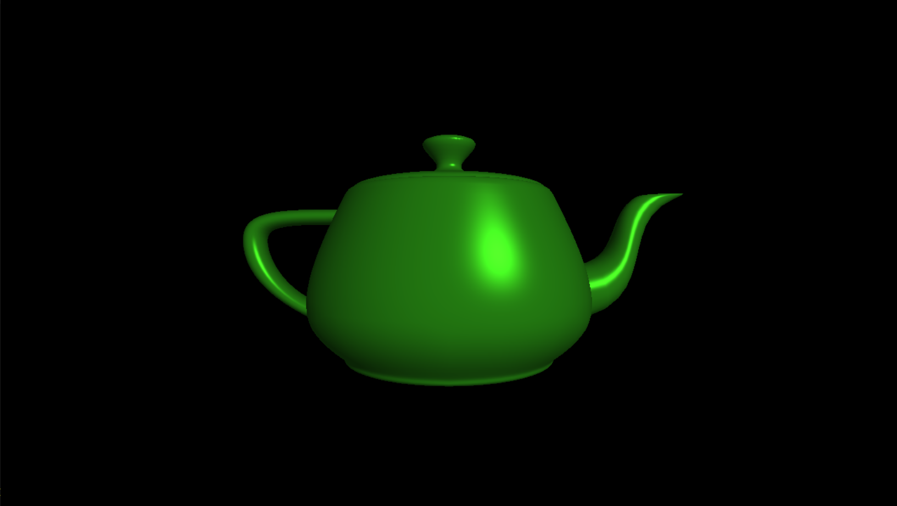

This project is an implementation of Blinn-Phong shading.

This is very similar to phong shading except that it calculates the specular component a little bit differently. Instead of computing the reflection vector of the light and the surface, it approximates it with something called the 'halfway' vector. The vector is the normalized vector of adding the view vector and the light vector. If either the viewer or the light is really far away (like directional light sources), the halfway vector limits towards a constant value regardless of surface position, which means this can be optimized a little bit by precomputing the halfway vector. 

