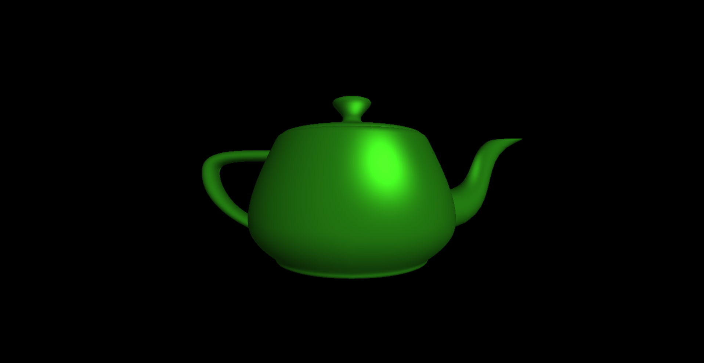

This project is an implementation of Phong shading using the Phong reflection model.

This is similar to Gouraud, except that the lighting calculation is done in the fragment shader and on a per-pixel basis. Rather than interpolating the vertices color of a pixel's corresponding triangle, it interpolates the verticea trributes (normal, position, etc) and uses those values in the lighting calculation. You can compare this with the Gouraud shading project and notice that this has has a much nicer specular component due to interpolating the values this way.

